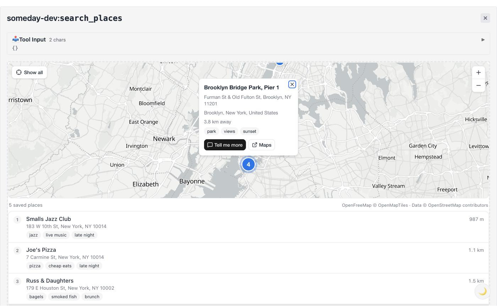

# Places map: a reference MCP App

An [MCP App](https://github.com/modelcontextprotocol/ext-apps) (`io.modelcontextprotocol/ui`, spec
2026-01-26) that renders saved places on an interactive map. It is the view for Someday's
`search_places` tool on Wire, and the reference an agent copies when it ships a UI in its Wire
manifest. Built with [mapcn](https://www.mapcn.dev/) (shadcn-registry map components on MapLibre GL),
React-style components compiled against Preact, Tailwind v4, and the ext-apps `App` SDK.



This package is self-contained. It is not part of the SDK's build, tests or published files.

## Build

```bash
npm install
npm run build        # dist/places-map.html (one file) + dist/csp.json
npm run verify:cdn   # optional: check the jsDelivr files match the installed maplibre-gl byte for byte
```

The build fails if the HTML is over Wire's per-UI cap (512 KB). It is about 337 KB today.
`ANALYZE=1 npm run build` prints what each package contributes.

## What it reads

The tool result, as `structuredContent` or as JSON in a text block (Wire's `tools/call` sends both):

```json
{ "presentation": "map", "center": { "lat": 40.7359, "lng": -73.9911 }, "matches": [ ... ] }
```

Each match is a `wire_search` match: `{ id, score, content, source, distance_km?, provenance, _meta }`.
**A match does not carry the record's fields.** Coordinates come from the `content` Someday's
`save_place` writes (`name\naddress\narea\nlat <lat>, lng <lng>`) and tags from `provenance.tags`.
`src/places.ts` also accepts `fields` / `object.fields` / `_fields` / `properties._fields`, JSON
content, and rows with top-level or nested `place` `lat`/`lng` (what's-on style). A match with no
usable coordinates is skipped and counted, never pinned at 0,0.

## What it does

Fits the map to every place. Each place gets a numbered pin, the search `center` gets a ring, and
the list sits under the map. Clicking a list row flies to the place; clicking a pin pans to it.
Either opens a popup with name, address, area, distance and tags. The popup has two buttons, each
shown only when the host declares the capability: **Tell me more** (`ui/message`) and **Maps**
(`ui/open-link`). The page follows the host's theme (`data-theme`), style variables and fonts. It
fills a fixed-height container, or reports its own height.

It also sends diagnostics as MCP log messages (`app.sendLog`, logger `places-map`): where the tile
worker runs, any CSP violation, and MapLibre load errors. The sandboxed iframe's console is often
out of reach, so this is how you debug a blank map.

## CSP and loading

`dist/csp.json`:

```json
{
  "connectDomains": ["https://tiles.openfreemap.org"],
  "resourceDomains": ["https://cdn.jsdelivr.net"]
}
```

- **MapLibre GL JS** (6.11.2, ~1 MB of ESM) is not bundled. An import map resolves `maplibre-gl` to
  jsDelivr, and the import map's `integrity` plus `modulepreload` links pin SHA-384 digests. The
  digests are computed at build time from the installed, exact-pinned package. The stylesheet
  loads the same way, with SRI. The version comes from `package.json`, so bump it there.
- **Tiles** come from [OpenFreeMap](https://openfreemap.org) (positron / dark). It is free, needs
  no key, allows commercial use, and serves the style, vector and raster tiles, sprites and glyphs
  from one origin. mapcn defaults to CARTO basemaps. To use those instead, pass mapcn's default
  `styles` and set `connectDomains` to `https://basemaps.cartocdn.com` and
  `https://*.basemaps.cartocdn.com`. Mind CARTO's terms for commercial use.
- **The tile worker.** MapLibre parses tiles in a module Web Worker. A worker can't be started from a
  cross-origin URL, so MapLibre starts it from a `blob:` URL. That needs `worker-src blob:`, which
  some hosts allow (basic-host does). The spec's reference CSP doesn't, and a Wire manifest's
  `csp` can only add https origins. `src/maplibre-worker.ts` probes once at startup. If blob
  workers are refused, it swaps in an in-thread stand-in. That stand-in runs the same
  `maplibre-gl-worker.mjs`, imported from jsDelivr on the main thread, over a `MessageChannel`.
  The map works under either CSP. Under the strict one, tile parsing runs on the main thread,
  which is fine for a page of places.
- **zod's JIT** probes `new Function` on first parse, which is a CSP violation without
  `'unsafe-eval'`. The page sets `jitless: true`, so no probe runs.
- The worker module that a real (blob) worker imports is fetched without SRI, because import maps
  don't apply inside workers. It is the same pinned, immutable jsDelivr version.

## In a Wire manifest

See `manifest-snippet.ts`:

```ts
ui: [{ name: 'places-map', title: 'Places map', html: placesMapHtml, csp }],
tools: [{ name: 'search_places', /* ...unchanged... */ ui: { resource: 'places-map' } }],
```

Wire serves it at `ui://<app id>/places-map`. Keep the tool's text result (`presentation: "map"` +
`matches`). A host without MCP Apps support shows only that.

## Test it locally

`dev-server/` is a stand-in for Someday on Wire. It exposes `search_places` over five NYC places,
in the engine's exact match shape, and serves the built HTML as `ui://someday/places-map`.

```bash
npm run build && npm run dev:server              # http://localhost:3001/mcp

git clone https://github.com/modelcontextprotocol/ext-apps && cd ext-apps/examples/basic-host
patch -p1 < <this dir>/dev-server/basic-host.patch   # optional: strict CSP, message capability
npm install && npm run build
bun serve.ts                                      # or STRICT_SPEC_CSP=1 bun serve.ts
# open http://localhost:8080, pick someday-dev / search_places, Call Tool
```

## Files

| Path | What |
|---|---|
| `src/components/ui/map.tsx` | mapcn's `map` component, installed with `npx shadcn add @mapcn/map`. One change: the CSS import is removed. |
| `src/App.tsx` | the view: connection, theme, sizing, map, list, popup |
| `src/places.ts` | tool result → places, defensively |
| `src/maplibre-worker.ts` | worker URL, blob probe, in-thread fallback |
| `src/diagnostics.ts` | CSP violations and errors → MCP log messages; zod jitless |
| `scripts/postbuild.mjs` | import map + SRI, `dist/csp.json`, size cap |
| `dev-server/` | local MCP server, sample places, basic-host test patch |
